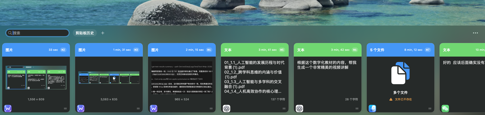

# WPaste

一款原生 macOS 剪贴板管理工具，让复制过的文字、链接、图片和文件随时可找、随手可贴。

使用 Swift 6、SwiftUI、AppKit 和 SwiftData 构建，常驻菜单栏。按下 **⌘⇧V** 打开剪贴板历史，再按一次收起。

## 使用效果预览



在同一面板中浏览图片、文本和文件记录，查看来源应用，并通过顶部搜索框快速查找内容。

## 下载与安装

当前版本为 **0.1.1**，可直接下载适合你 Mac 的安装包，或前往 **[GitHub Releases](https://github.com/chujianyun/xpaste/releases/latest)** 查看发布详情。

| 你的 Mac | 安装包 |
| --- | --- |
| Apple 芯片（M 系列） | [WPaste-0.1.1-macOS-arm64.dmg](https://github.com/chujianyun/xpaste/releases/download/v0.1.1/WPaste-0.1.1-macOS-arm64.dmg) |
| Intel 处理器 | [WPaste-0.1.1-macOS-x86_64.dmg](https://github.com/chujianyun/xpaste/releases/download/v0.1.1/WPaste-0.1.1-macOS-x86_64.dmg) |

**系统要求：macOS 15.0 或更高版本。** 在苹果菜单 →「关于本机」中查看芯片或处理器类型。

1. 打开下载的 DMG，将 `WPaste.app` 拖入「应用程序」。
2. 从「应用程序」启动 WPaste，菜单栏中会出现应用入口。
3. 如需自动粘贴，在「系统设置 → 隐私与安全性 → 辅助功能」中允许 WPaste。未授权时仍可复制历史内容，再自行按 ⌘V 粘贴。

当前版本使用 Apple Development 开发证书签名，**尚未使用 Developer ID 分发签名，也未完成 Apple 公证**。首次打开可能被 macOS 拦截；确认来自本仓库的 Release 后，可在「系统设置 → 隐私与安全性」中使用「仍要打开」。受组织管理的 Mac 可能无法放行。

仓库提供本版本的 [SHA256SUMS.txt](https://raw.githubusercontent.com/chujianyun/xpaste/main/docs/releases/v0.1.1/SHA256SUMS.txt)，可将其与两个 DMG 放在同一目录后校验：

```bash
shasum -a 256 -c SHA256SUMS.txt
```

## 0.1.1 更新

- 修复打开历史面板后，原应用引用可能提前释放、导致自动粘贴失败的问题。
- 修复未授予辅助功能权限时反复弹出授权提示的问题；同次运行只提示一次，仍可复制历史内容，授权后再次粘贴即可恢复自动粘贴。

完整说明见 [0.1.1 发布说明](docs/releases/v0.1.1.md)。

## 能做什么

- **找回复制记录**：支持文字、URL、图片、单个及多个文件；重复内容合并，最近使用的内容排在前面。
- **快速搜索**：按文字、链接、文件名或来源应用查找，搜索框支持一键清空。
- **收藏常用内容**：使用 Pinboard 分类收藏，同一条内容可以加入多个分类；支持重命名、排序和删除分类。
- **快速粘贴**：点击卡片，或用方向键选择后按回车；历史面板内可用 ⌘1–⌘9 选择并粘贴对应项目。
- **纯文本粘贴**：通过右键菜单去掉文本格式，也可以在设置中设为默认行为。
- **管理保留期限**：支持 1 天、1 周、1 个月、1 年或永久保存，默认保留 1 周。
- **控制记录范围**：暂停记录、排除指定应用、过滤声明为敏感或瞬时的剪贴板内容，以及退出时清空历史。

## 使用方式

| 操作 | 方式 |
| --- | --- |
| 打开 / 收起历史面板 | ⌘⇧V，可在设置中修改 |
| 选择历史项目 | ← / → |
| 粘贴选中项目 | 回车 |
| 快速粘贴前九项 | 历史面板内按 ⌘1–⌘9 |
| 关闭面板 | Esc |
| 打开设置 | 菜单栏「设置…」，或历史面板右上角「…」 |
| 收藏、纯文本粘贴、删除 | 右键点击卡片 |

文件记录保留的是文件位置；原文件被移动或删除后，不能继续从该记录粘贴文件。

## 数据与隐私

剪贴板历史通过 SwiftData 保存在本机，图片保存在本机 Application Support 目录下的 `WPaste/Images` 中。应用没有账号登录或云端历史同步功能。

链接预览默认开启，生成预览时可能访问对应网站，可在隐私设置中关闭。敏感内容过滤依赖来源应用和剪贴板类型标记，不会识别所有文本中的密码或隐私信息；不希望被记录的应用应加入忽略列表。

## 从源码构建

需要支持 Swift 6 和 macOS 15 SDK 的 Xcode，以及 [XcodeGen](https://github.com/yonaskolb/XcodeGen)。

```bash
git clone https://github.com/chujianyun/xpaste.git
cd xpaste
brew install xcodegen
xcodegen generate
open WPaste.xcodeproj
```

仓库目前固定了作者本机的开发签名证书。其他开发者需先按 [签名说明](Config/Signing.md) 配置自己的证书，并同步修改签名校验与测试；直接执行打包脚本会在缺少指定证书时停止。

运行完整测试：

```bash
xcodebuild test \
  -project WPaste.xcodeproj \
  -scheme WPaste \
  -destination "platform=macOS,arch=$(uname -m)"
```

在已配置仓库指定证书的机器上打包：

```bash
Scripts/package-dmg.sh
hdiutil verify build/WPaste.dmg
```

脚本先运行完整测试，再生成通用版 `build/WPaste.xcarchive` 和 `build/WPaste.dmg`。

发布两个芯片版本时，在测试通过后分别使用 `ARCHS=arm64`、`ARCHS=x86_64` 和 `ONLY_ACTIVE_ARCH=NO` 归档到独立路径。每个 DMG 放入对应归档的 `WPaste.app`，并附上指向 `/Applications` 的 `Applications` 快捷链接，方便拖拽安装。逐一检查二进制架构、签名和 DMG 校验，再为两个 DMG 生成 `SHA256SUMS.txt`。更多验收项目见 [发布检查清单](docs/release-checklist.md)。

## 作者：悟鸣

浙江省人工智能专家服务团专家、前蚂蚁集团高级 Agent 工程师、集团年度最受欢迎讲师、Qoder 大使、千问办公大使。

关注 AI、Agent 与 AI 编程的实际应用，分享工具、方法和实践经验。

| 悟鸣AI | 微信公众号 |
| :---: | :---: |
|  |  |
| 扫码添加悟鸣AI，交流与合作 | 扫码关注公众号，获取 AI 实践分享 |

## 反馈

欢迎通过 [GitHub Issues](https://github.com/chujianyun/xpaste/issues) 提交问题或建议。反馈问题时请附上 macOS 版本、芯片类型、WPaste 版本和复现步骤；截图前请隐去剪贴板中的私人内容。
